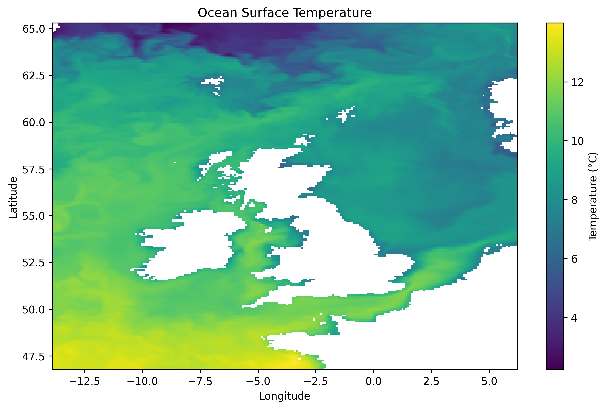

---
hide:
  - toc
---

# Leveraging GPUs

To highlight the difference between NumPy and CuPy, a 3D temperature diffusion model is used to highlight the difference in performance that can be achieved for computationally intensive tasks. 

# Data 

For this task, starting data of 3-dimensional Ocean Temperatures are required, which we can download from the [Copernicus Marine Data Service](https://data.marine.copernicus.eu/product/GLOBAL_ANALYSISFORECAST_PHY_001_024/description). 

## Downloading Data 

A utility function has been included with the repo for this course bundled with poetry, as explained in the [Setup Guide](00_setup.md). 

``` bash 
poetry run download_data
```

will download the required dataset for this course into nthe `./data` directory. The dataset that is downloaded is: 

**Description**:  
This dataset was downloaded from the **Global Ocean Physics Analysis and Forecast** service. It provides data for global ocean physics, focusing on sea water potential temperature.

- **Product Identifier**: `GLOBAL_ANALYSISFORECAST_PHY_001_024`
- **Product Name**: Global Ocean Physics Analysis and Forecast
- **Dataset Identifier**: `cmems_mod_glo_phy-thetao_anfc_0.083deg_PT6H-i`

**Variable Visualized**:  
- **Sea Water Potential Temperature (thetao)**: Measured in degrees Celsius [°C].

**Geographical Area of Interest**:  
- **Region**: Around the United Kingdom
- **Coordinates**:
  - **Northern Latitude**: 65.312
  - **Eastern Longitude**: 6.1860
  - **Southern Latitude**: 46.829
  - **Western Longitude**: -13.90

**Depth Range**:  
- **Minimum Depth**: 0.49 meters  
- **Maximum Depth**: 5727.9 meters

**File Size**:  
- **267.5 MB**

## Visualising Data 

To make the process of visualising the data easier, three different utility functions have been created. The defeault output locations for the visualisations is within the `output` directory.

### Visualise Slice (Static) 

Visualizing a 2D temperature slice. The depth that will be targetted is the surface, e.g. 0.49m.

``` bash 
poetry run visualise_slice_static
```

The output producded will be a `.png` file, such as: 




### Visualise Slice - Interactive HTML file

Visualizing a 2D temperature slice in an interactive HTML file, allowing for a time series to be visualised. 

``` bash 
poetry run visualise_slice --target_depth 50 --animation_speed 100
```

The command above will create an interactive HTML file, that will have each timestep in the animation last for 100 milliseconds (`--animation_speed`) at the nearest depth to the closest depth (`--target_depth`), in this case 47.37m. For the above command the output producded will be: 

<div class="responsive-container">
    --8<-- "course/_static/temperature_slice.html"
</div>

<center>[View Plot in Seperate Tab](../_static/temperature_slice.html)</center>

### Visualise Cube - Interactive HTML file

Visualizing a 3D temperature slice in an interactive HTML file, allowing for a time series to be visualised. 

``` bash 
poetry run visualise_cube --num_depths 5 --num_time_steps 3
```


The command above will create an interactive HTML file, that will visualise the first 5 depth, for 3 time steps. For the above command the output producded will be: 

<div class="responsive-container">
    --8<-- "course/_static/temperature_cube.html"
</div>


<center>[View Plot in Seperate Tab](../_static/temperature_cube.html)</center>

## Summarising Data 

Calculates and prints summary statistics for temperature data in a specified NetCDF file. Prints its mean, max, min, and standard deviation. Also provides information about the dataset’s dimensions and coordinates.

``` bash 
poetry run summary
```


The above command will print out the summary of the data on the original datafile downloaded from Copernicus. The above command will output the following: 

``` plaintext 
The dimensions of the data is: (5, 50, 222, 241)
Temperature Summary Statistics:
Mean temperature: 8.56154727935791
Max temperature: 14.050389289855957
Min temperature: -2.591400146484375
Standard deviation: 3.1273183822631836

Dataset Dimensions and Coordinates:
<xarray.Dataset>
Dimensions:    (depth: 50, latitude: 222, longitude: 241, time: 5)
Coordinates:
  * depth      (depth) float32 0.494 1.541 2.646 ... 5.275e+03 5.728e+03
  * latitude   (latitude) float32 46.83 46.92 47.0 47.08 ... 65.08 65.17 65.25
  * longitude  (longitude) float32 -13.83 -13.75 -13.67 ... 6.0 6.083 6.167
  * time       (time) datetime64[ns] 2024-01-01 ... 2024-01-02
Data variables:
    thetao     (time, depth, latitude, longitude) float32 13.47 13.42 ... nan
Attributes: (12/14)
    Conventions:                   CF-1.6
    area:                          GLOBAL
    contact:                       servicedesk.cmems@mercator-ocean.eu
    credit:                        E.U. Copernicus Marine Service Information...
    institution:                   Mercator Ocean
    licence:                       http://marine.copernicus.eu/services-portf...
    ...                            ...
    product_user_manual:           http://marine.copernicus.eu/documents/PUM/...
    quality_information_document:  http://marine.copernicus.eu/documents/QUID...
    references:                    http://marine.copernicus.eu
    source:                        MERCATOR GLO12
    title:                         Instantaneous fields for product GLOBAL_AN...
    copernicusmarine_version:      1.3.4
```

